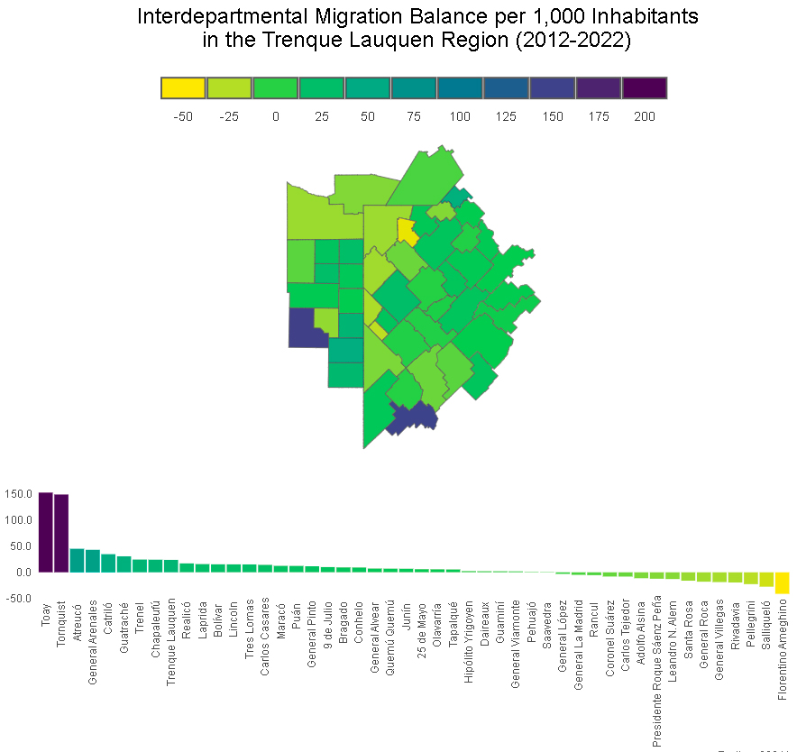
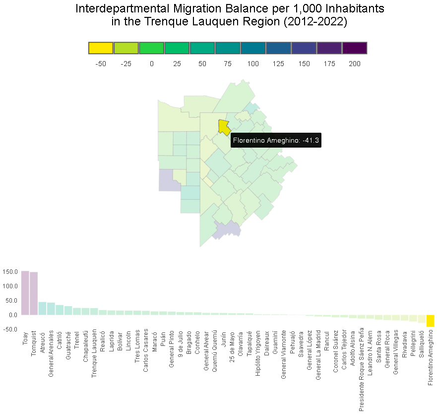
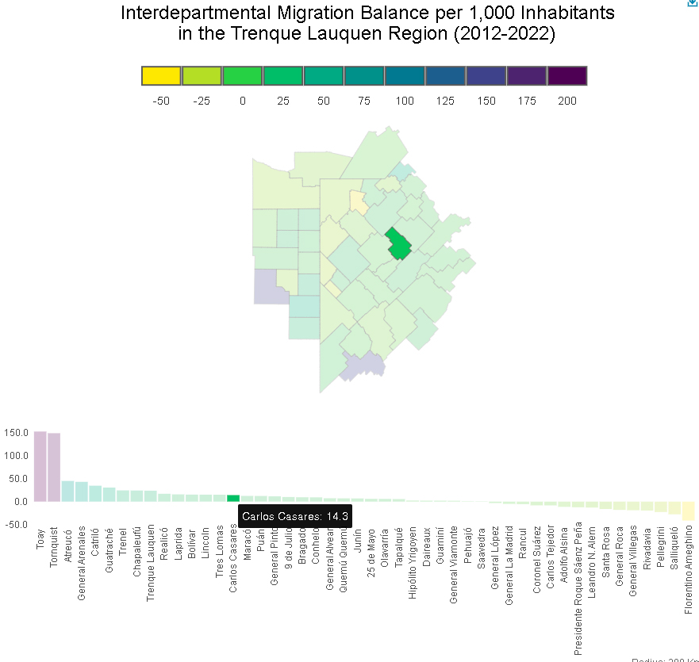

# Interdepartmental Migration Balance per 1,000 Inhabitants in the Trenque Lauquen Region (2012-2022)

This repository contains an R code that generates an interactive map and a table illustrating the internal migration rate per 1,000 inhabitants in the Trenque Lauquen district, Argentina, and districts located up to 200 km away.
The R code responsible for generating this map is available [here](https://github.com/marcoscarloseduardo/renaper-chart-map/blob/main/main.R).

Access the Interactive Map
The generated map offers interactivity by hovering the mouse pointer over the departments or districts, providing relative migration values. Additionally, the bottom table allows highlighting a specific department on the map.  
Click [here](https://marcoscarloseduardo.github.io/) to access the interactive map.

## Map Preview

  

  

  

## Analysis Details
The analysis reveals significant patterns in internal migration in Argentina between 2012 and 2022. We highlight that the districts of Ameghino, Salliqueló, Pellegrini, Rivadavia, and General Villegas experienced the highest relative losses of inhabitants, considering their population. In contrast, the districts of Toay, Tornquist, Atreucó, General Arenales, and Catriló experienced the highest relative growth during the same period.

The study's universe consists of individuals residing in Argentina who changed their department of residence between 2012 and 2022, according to RENAPER2 records. "Internal migrants" are defined as those who declared a different department of residence between two consecutive transactions.

Migration Balance: It is the difference between the number of immigrants and emigrants.

## Credits
This code is based on a contribution shared by [Kyle Walker](@kyle_e_walker), who, in turn, drew inspiration from a visualization of U.S. census data on the percentage of workers working from home.

<i>Note</i>: This analysis utilizes RENAPER data and focuses on internal migration in Argentina during the mentioned period.
